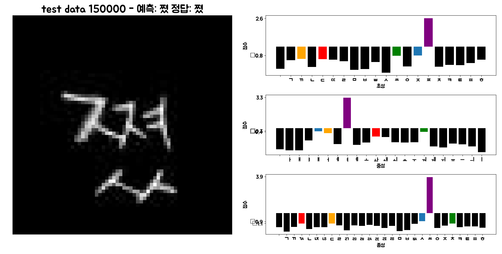
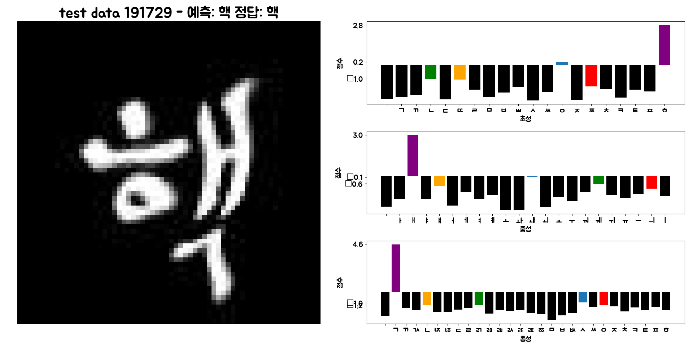
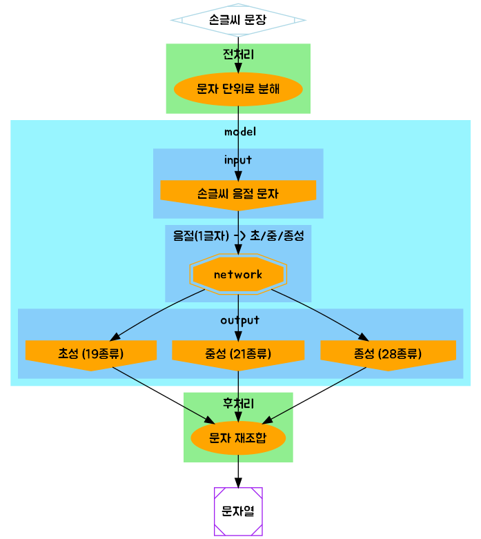

# Handwriting-Detection
 
### 1. 손글씨 음절을 문자열로 바꾸기
### source 
> https://github.com/IBM/tensorflow-hangul-recognition






---

### 2. 손글씨 문장을 문자열로 바꾸기
> https://aihub.or.kr/problem_contest/nipa-learning-platform/1

---

### 로드맵


---

### 1. 필요한 라이브러리 설치

```python
pip install -r requirements.txt
```

---

### 2. 데이터셋 생성
> default: data-syllable/ 경로에 생성됨

```python
# 이 파일만 실행시키면 됩니다.
python data.py # 데이터 없으면 생성시킴
```

```python
# 데이터 생성 시 실행되는 파일들
# 1. tools/hangul_image_generator.py
# 2. tools/syllable_to_phoneme.py
# 3. tools/data_seperator.py
```

1. fonts/ 안의 폰트들로 음절 이미지 생성
2. 음절을 음소로 분류한 라벨 생성
3. 전체 데이터셋에서 Test 용 데이터셋 분리
---

### 3. 학습
```python
python train.py
```

---

### 4. 추론

```python 
python test.py
```

---