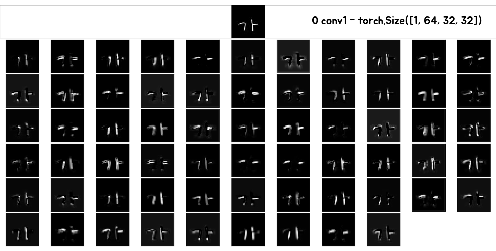
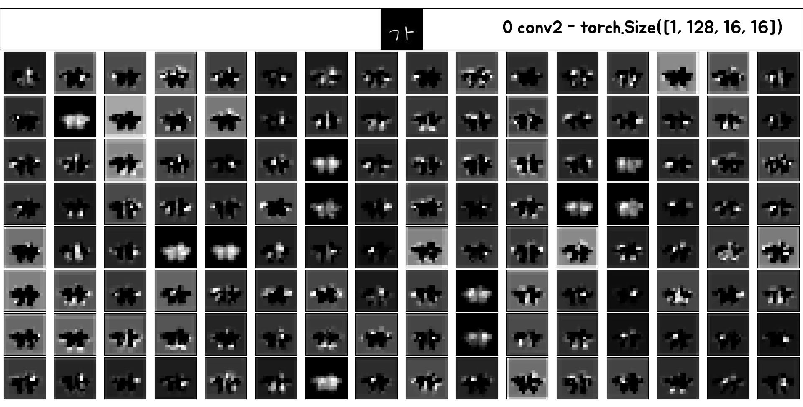
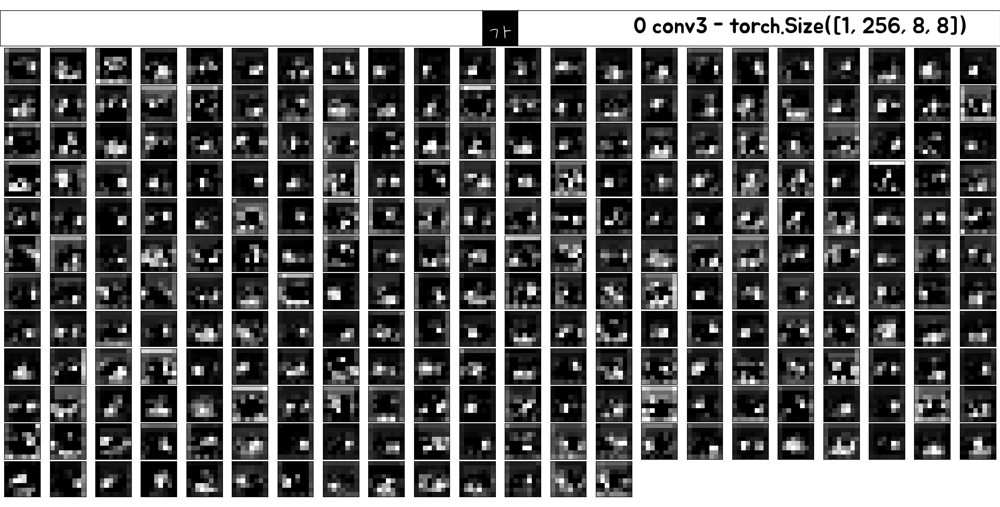
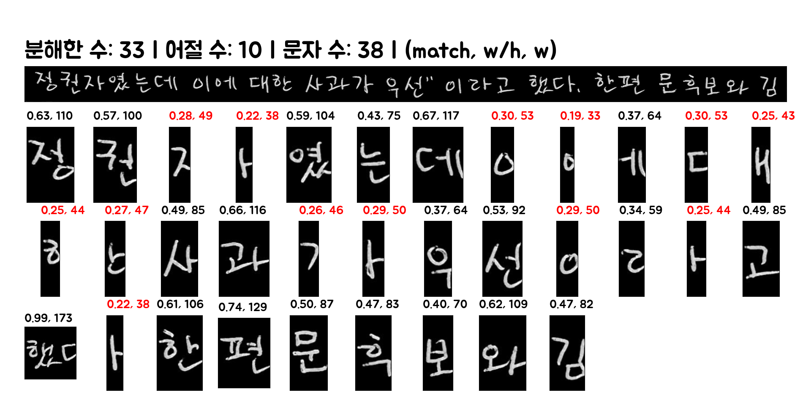
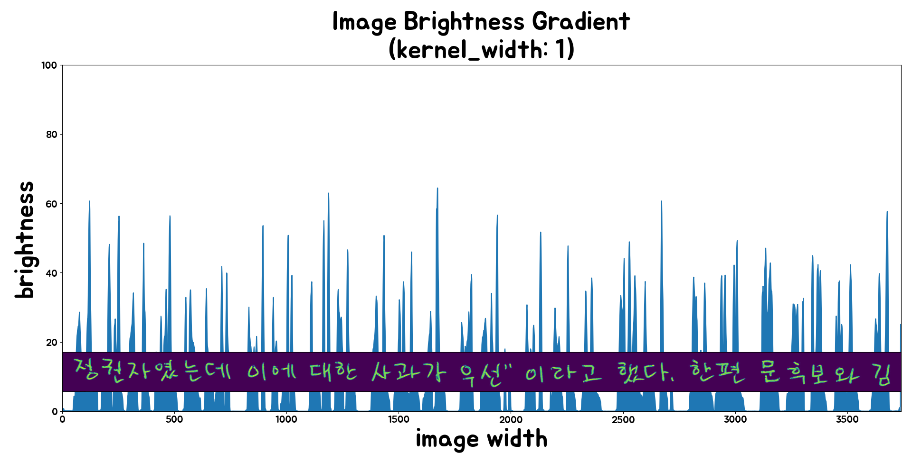
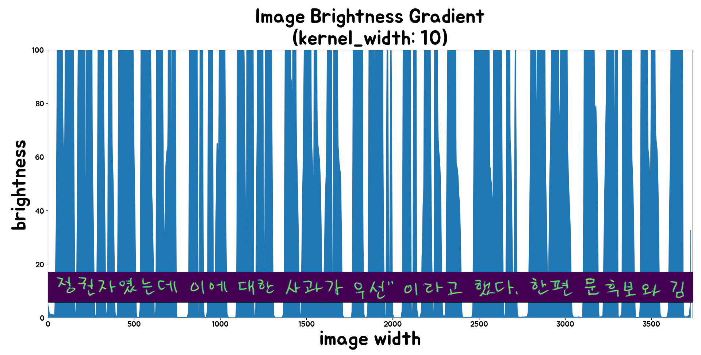

# Handwriting-Detection

> test_pygame.py


---

## 1. 손글씨 음절을 문자열로 바꾸기 (완성)

### source 
> [github.com/IBM/tensorflow-hangul-recognition](https://github.com/IBM/tensorflow-hangul-recognition)

---

## 결과


---

## Feature Maps




---

## 2. 손글씨 문장을 문자열로 바꾸기 (미완성)
> [AI Hub 한국어 손글씨 탐지 모델](https://aihub.or.kr/problem_contest/nipa-learning-platform/1)

> [인공지능 놀이터 예제 코드 (Baseline Code)](https://ai-korea.kr/playground/selectTutorialPlayground.do)





---

## 로드맵 (Roadmap)


---

## 1. 필요한 라이브러리 설치 (python 3.10.4)


```python
pip install -r requirements.txt
```

---

## 2. 데이터셋 생성
> 음절 데이터: data-syllable/ 경로에 생성됨 - 반자동 생성

> 문장 데이터: data/ 경로에 생성됨 - 자동 생성

> data.py 실행 시 [fonts/](fonts/) 안의 폰트들로 음절 데이터셋 생성됨

> [fonts/](fonts/) 에 한글 폰트 추가 필요 [Fonts Download Link](https://hangeul.naver.com/2021/fonts)

```python
# 그 후에 이 파일만 실행시키면 됩니다.
python data.py # 데이터 없으면 생성시킴
```

```python
# 데이터 생성 시 실행되는 파일들
# 1. tools/hangul_image_generator.py
# 2. tools/syllable_to_phoneme.py
# 3. tools/data_seperator.py
```

1. fonts/ 안의 폰트들로 음절 이미지 생성
2. 음절을 음소로 분류한 라벨 생성
3. 전체 데이터셋에서 Test용 데이터셋 분리
---

## 3. 학습
> 학습한 모델 저장되는 경로: [outputs/](outputs/)
```python
python train.py train.epoch=1 train.batch_size=50
```

> 줄 수 있는 인자 목록 ([config/](config/)*.yaml 파일에서도 설정 가능)
```
train.epoch: 몇 바퀴 학습시킬 건지
train.batch_size: 묶어서 학습할 수
train.lr: 학습률
train.print_every: 학습 로그 출력하는 간격
train.load_model: 이어서 학습시킬 모델 날짜 부분 경로

model.layer_in_channels: 합성곱 계층으로 들어가는 채널 수들
model.layer_out_channels: 합성곱 계층에서 나오는 채널 수들
model.hiddens: 완전연결 계층 노드 수
model.conv_activation: 합성곱 계층 활성화 함수
model.ff_activation: 완전연결 계층 활성화 함수
model.dropout: 드롭아웃 확률 (0~1)
```

> 학습 로그


---

## 4. 테스트

```python 
python test.py --load-model <model path>
# --load-model: 불러올 모델 경로
# --batch-size: 묶어서 테스트할 수
```

### 직접 글씨 써서 인식해보기
```python 
python test_pygame.py --load-model <model path>
# --load-model: 불러올 모델 경로
```

> test_pygame.py


---